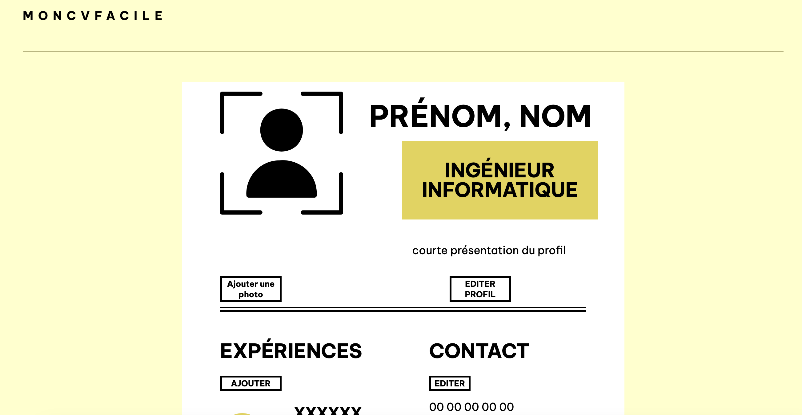

# Générateur de CV
Ce générateur de CV vous permet de produire un CV élégant et moderne en quelques clics.

**Link to project:** https://cv-application-a2k75ecg4-kure-ru.vercel.app/

## Comment je l'ai fait:

**Technologies:** React, TypeScript
Cette application web  permet de créer un CV professionnel en quelques minutes seulement. Elle est conçue pour être facile à utiliser et intuitive, même pour les utilisateurs novices. Vous pouvez facilement ajouter vos informations personnelles, votre expérience professionnelle, vos compétences, vos formations, ainsi que d'autres détails pertinents pour votre profil.

De plus, cette application web est conçue pour être réactive et adaptable, ce qui signifie qu'elle s'adapte à tous les types d'écrans, y compris les téléphones mobiles, les tablettes et les ordinateurs de bureau. Cela garantit une expérience utilisateur optimale quel que soit l'appareil utilisé.

## Optimisations

* [ ] Rendre l'application responsive
* [ ] Ajouter un bouton pour sauvegarder un pdf
* [ ] Ajouter d'autres choix de design
* [ ] Possibilité de modifier les catégories

## Leçons apprises

- J'ai consolidé mes bases de **React**, notamment en utilisant le hook `useState` pour stocker les informations de l'utilisateur.
- Ce projet était mon premier projet **TypeScript** . J'ai appris à définir des interfaces et des types, ainsi qu'à définir le type de toutes les props.
- J'ai appris à mieux **structurer** mon projet, en divisant chaque partie du CV en un composant pour que mon application soit organisée et facilement maintenable. 

-------- 

Design inspiré de [Minimal CV Resume](https://dribbble.com/shots/21134605-Minimal-CV-Resume)